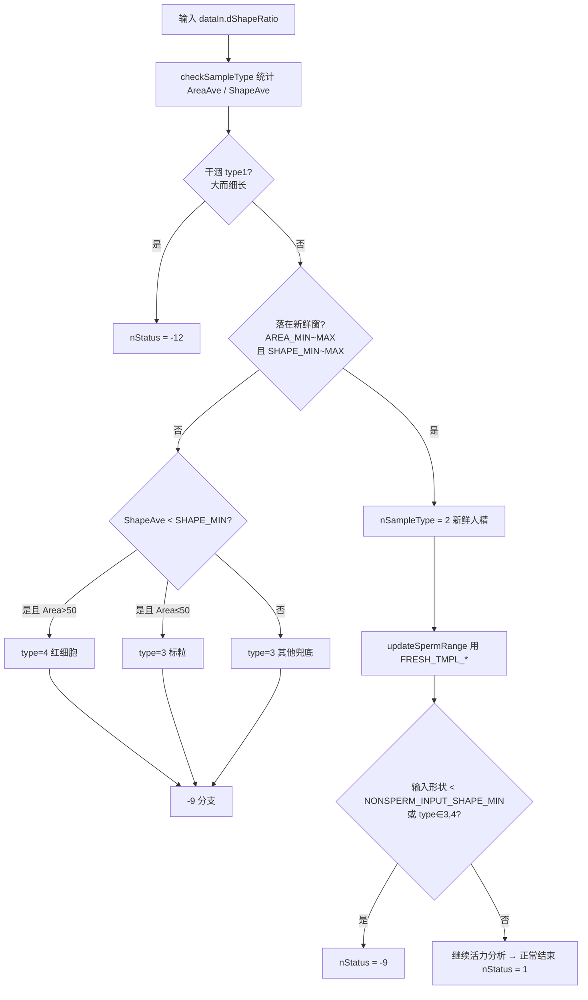

# 放宽「非精子 / nStatus=-9」——操作手册

> 旧长文 `nStatus-9-threshold-guide.md` 可留作备用。  
> **你日常只看本文即可。** 代码里一键旋钮在 `CountSpermMed.cpp` 文件头宏区。

---

# 方式一：简洁明确（照着改数字就能跑）

## 你要改哪里？

打开 `CountSpermMed.cpp`，找到文件头这一块（约在 `EPSINON` 下面）：

| 宏 | 当前放宽值 | 原来 | 你想…… | 怎么拧 |
|----|------------|------|--------|--------|
| `NONSPERM_INPUT_SHAPE_MIN` | **0.50** | 0.8 | 输入形状更低也不报 -9 | **再减小** |
| `FRESH_SPERM_AREA_MIN` | **8.0** | 11 | 更小颗粒也当精子 | **再减小** |
| `FRESH_SPERM_AREA_MAX` | **50.0** | 35 | 更大颗粒也当精子 | **再增大** |
| `FRESH_SPERM_SHAPE_MIN` | **1.05** | 1.15 | 更圆也当精子 | **再减小（最低约 1.0）** |
| `FRESH_SPERM_SHAPE_MAX` | **2.10** | 1.8 | 更细长也当精子 | **再增大** |
| `FRESH_TMPL_*` | 已配套放宽 | Area 11~22 等 | 分类通过后仍能检出小/大目标 | 与上表同方向调 |

**只改上面这些宏即可。** 分类窗、`-9` 两处判断、检出模板已全部引用它们。

## 「面积」是什么？

是的：**被识别出的颗粒轮廓面积**（pixel²），分类时用的是整幅有效目标的 **平均面积 `dAreaAve`**，不是单个最大/最小。

## 「形态」是什么？

**长轴 / 短轴**（`dShapeRatio`）：
- `≈1.0` → 接近圆
- `越大` → 越细长

## 放宽 vs 收紧（按代码）

| 说法 | 对面积窗 | 对形态窗 | 结果 |
|------|----------|----------|------|
| **放宽** | ↓MIN 且/或 ↑MAX | ↓MIN 且/或 ↑MAX | 更多样本 → `nSampleType=2` → 更容易 `nStatus=1` |
| **收紧** | ↑MIN 且/或 ↓MAX | ↑MIN 且/或 ↓MAX | 更多样本 → type3/4 → `nStatus=-9` |

你的要求是 **放宽**：代码里已按上表做了一轮全面放宽；若仍有漏网，继续按「再减小 MIN / 再增大 MAX」拧。

## 三件事对照你的需求

1. **大小放宽** → 主要拧 `FRESH_SPERM_AREA_MIN/MAX`，并保持 `FRESH_TMPL_AREA_*` 同方向。  
2. **形态放宽** → 主要拧 `FRESH_SPERM_SHAPE_MIN/MAX`。  
3. **输入也不要轻易 -9** → 拧 `NONSPERM_INPUT_SHAPE_MIN`（调用方 `dataIn->dShapeRatio` 仍建议 ≥0.5）。

## 仍报 -9 时 10 秒判断

1. 打印 `nSampleType`：若是 **3 或 4** → 面积/形态仍出窗，继续放宽 `FRESH_SPERM_*`。  
2. 若是 **2** 但仍 -9 → 看输入 `dShapeRatio` 是否 `< NONSPERM_INPUT_SHAPE_MIN`。  
3. 若变成 **-12** → 被干涸规则拦住（大而细长），那是另一套阀值，不是 -9。

---

# 方式二：详细剖析（有时间再看）

## 逻辑总图



要点：

- **`-9` 赋值本身只有一处**，条件是：输入形状过低 **或** 分类为 3/4。  
- **大小/形态是否“像精子”**，真正卡在 **`checkSampleType` 的新鲜窗**；出窗 → type3/4 → `-9`。  
- 只删 `-9` 那行 `if`、不扩新鲜窗：分类仍是 3/4，会走标粒计数路径，**语义错误**。所以要全面放宽，必须改分类窗（+ 检出模板）。

## （1）大小：改什么？为何不止那一个 if？

### 是不是面积？

是。分类用的是轮廓面积统计得到的 **`dAreaAve`（pixel²）**。

### 直接导致 -9 的 if

```cpp
if (dShapeRatio < NONSPERM_INPUT_SHAPE_MIN || nSampleType == 3 || nSampleType == 4)
    nStatus = -9;
```

这里 **没有面积数字**。面积是通过「让不让 `nSampleType` 变成 3/4」间接起作用的。

### 面积真正起作用的地方

```cpp
else if (AreaAve <= FRESH_SPERM_AREA_MAX && AreaAve > FRESH_SPERM_AREA_MIN
      && ShapeAve >= FRESH_SPERM_SHAPE_MIN && ShapeAve < FRESH_SPERM_SHAPE_MAX)
    nSampleType = 2;  // 正常精子路径
```

| 改动 | 效果 |
|------|------|
| ↓ `FRESH_SPERM_AREA_MIN`（11→8→更小） | 更小平均面积仍判 type2，不再兜底成 type3 → 避免 -9 |
| ↑ `FRESH_SPERM_AREA_MAX`（35→50→更大） | 更大平均面积仍判 type2 |
| 配套 ↑↓ `FRESH_TMPL_AREA_*` | type2 之后检出窗 `[0.7*Min, 2*Max]` 同步变宽，小/大目标能被数到 |

### 还要不要改别的？

| 位置 | 要不要动 | 原因 |
|------|----------|------|
| `-9` 的 if | 已改为用宏；一般不用删 | 删了但 type 仍为 3/4 → 路径错 |
| `checkSampleType` 新鲜面积窗 | **要，主战场** | 决定 type2 vs 3/4 |
| `updateSpermRange` / `FRESH_TMPL_*` | **建议同步** | 避免“判成精子却数不到” |
| 干涸 type1 条件 | 通常不动 | 防大而干涸样本；过大且细长会变 -12 而非 -9 |
| 全局 `dMinArea=8` / `dMaxArea=200` | 极小目标筛不进统计时再降 `dMinArea` | 分类前的初筛 |

## （2）形态：放宽 / 收紧在代码里长什么样？

形态量：`ShapeRatio = 长轴 / 短轴`（≥1）。

### 放宽（你要的）

```text
原窗:  Shape ∈ [1.15, 1.8)
放宽:  Shape ∈ [1.05, 2.10)     ← MIN↓ 且 MAX↑
```

- **MIN 下降**：原来 `1.10` 这种偏圆会进「Shape<1.15 → 标粒/红细胞 → -9」；现在可进 type2。  
- **MAX 上升**：原来 `1.9` 这种偏长会掉进「else → type3 → -9」；现在可进 type2。

### 收紧（反面，不要做）

```text
例如改成 [1.25, 1.6)   ← MIN↑ 且 MAX↓ → 更多 -9
```

### 与输入 `dShapeRatio` 的区别

| 变量 | 来源 | 作用 |
|------|------|------|
| `SParaInput.dShapeRatio` | 调用方传入 | 与 `NONSPERM_INPUT_SHAPE_MIN` 比，可直接 -9 |
| `pSSpermRange.dShapeRatio` | 图像统计 | 进不进新鲜形态窗 → 间接 -9 |

形态放宽主要拧 **统计窗的 SHAPE_MIN/MAX**；输入侧拧 **NONSPERM_INPUT_SHAPE_MIN**。

## （3）本轮已落地的数值（相对原版）

| 项 | 原 | 现（放宽） |
|----|----|------------|
| 输入形状下限 | 0.8 | **0.50** |
| 新鲜面积窗 | (11, 35] | **(8, 50]** |
| 新鲜形态窗 | [1.15, 1.8) | **[1.05, 2.10)** |
| 检出 AreaMin/Max | 11 / 22 | **7 / 40** |
| 检出 Shape 模板 | 1.23 | **1.15** |

若仍偏严：继续同方向拧宏。若标粒/红细胞质控也被当成精子：往回收一点（收紧）。

## 修改建议优先级

1. **必改（已做）**：`FRESH_SPERM_AREA_*` + `FRESH_SPERM_SHAPE_*` + `NONSPERM_INPUT_SHAPE_MIN`  
2. **强烈建议（已做）**：`FRESH_TMPL_*` 同方向  
3. **按需**：极小轮廓进不了统计 → 略降 `dMinArea`  
4. **不推荐**：只注释掉 `-9` 赋值而不改分类窗
