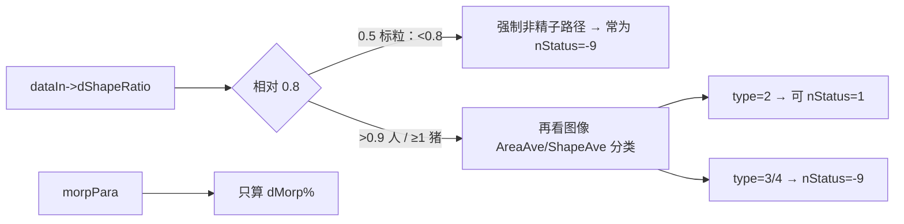
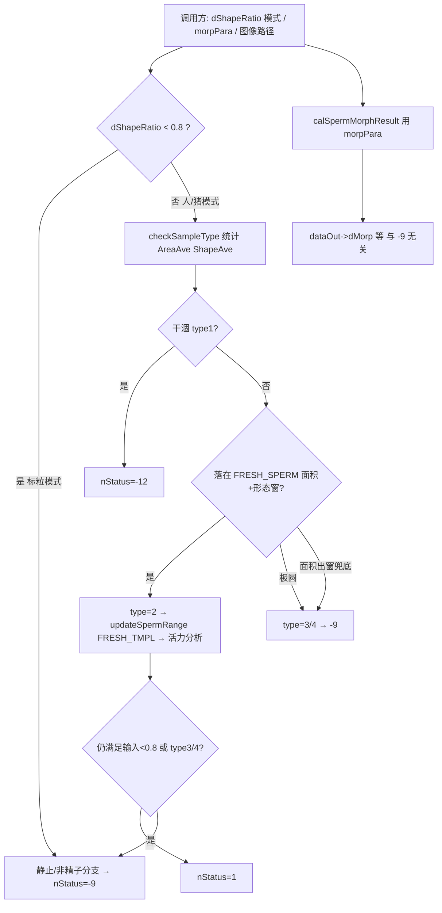

# 放宽「非精子 / nStatus=-9」操作手册（已对照 COUNTSPERMMED.H 更新）

> 旧文 `nStatus-9-threshold-guide.md` 备用。  
> **以本文 + 头文件语义为准。**

---

# 方式一：简洁明确（照着做）

## 先分清三个“形状/面积”（头文件澄清后）

| 名字 | 在哪 | 是什么 | 会不会导致 -9 |
|------|------|--------|----------------|
| **`dataIn->dShapeRatio`** | 头文件输入 | **模式开关**：`0.5`=标粒模式，`≥1`=猪精模式（注释还有 `>0.9` 人精） | **会**：`< 0.8` 直接走非精子/-9（**标粒模式的预期行为**） |
| **图像 `AreaAve` / `ShapeAve`** | `checkSampleType` | 画面里颗粒的**平均面积**、**平均长/短轴** | **会**：出“新鲜精子窗”→ type3/4 → -9 |
| **`morpPara`（dArea/dShape/…）** | 头文件输入 | 形态学“正常”判定区间 | **不会**：只影响输出 `dMorp%`，与 -9 无关 |

**大小** = 图像轮廓面积（分类用平均面积 `dAreaAve`，pixel²）。  
**形态（判 -9 用的）** = 图像统计的长/短轴，**不是**随便去拧 `morpPara`。

## 你要正常精子结果 `nStatus=1` 时，调用方先做对这件事

```text
标粒质控：  dataIn->dShapeRatio = 0.5     → 预期 -9（不要改）
人精分析：  dataIn->dShapeRatio > 0.9     （建议 1.2 左右）
猪精分析：  dataIn->dShapeRatio ≥ 1       （按头文件）
```

**不要**为了“放宽”把 `NONSPERM_INPUT_SHAPE_MIN` 降到 0.5：那样输入 `0.5` 时 `0.5 < 0.5` 为假，会破坏头文件约定的标粒模式。

## 代码里只拧这些宏（文件头）

| 需求 | 宏 | 方向 |
|------|-----|------|
| 更小颗粒也当精子 | `FRESH_SPERM_AREA_MIN`（现 8） | ↓ |
| 更大颗粒也当精子 | `FRESH_SPERM_AREA_MAX`（现 50） | ↑ |
| 更圆也当精子 | `FRESH_SPERM_SHAPE_MIN`（现 1.05） | ↓（≥1.0） |
| 更细长/猪精也当精子 | `FRESH_SPERM_SHAPE_MAX`（现 2.10） | ↑（猪精可试 2.4~2.6） |
| 分类过后还能数到 | `FRESH_TMPL_*` | 与上同方向 |
| 输入模式分界 | `NONSPERM_INPUT_SHAPE_MIN` | **保持 0.8**（勿为放宽而降到 0.5） |

**放宽** = ↓MIN / ↑MAX → 更多 `nSampleType=2` → 更容易 `nStatus=1`  
**收紧** = ↑MIN / ↓MAX → 更多 type3/4 → `-9`

## `morpPara` 什么时候拧？

只当你要改输出里的 **形态正常比例 `dMorp`**（以及依赖它的形态指标）时：放宽 `morpPara.dArea/dShape/...` 的 min~max。  
**它不会让 -9 变成 1。**

---

# 方式二：详细剖析（对照头文件）

## 头文件带来的关键更正

```cpp
double dShapeRatio; // 目标的长宽比，0.5为标粒模式，1以上为猪精模式
```

此前若把输入 `dShapeRatio` 仅理解成“几何阀值、越小越要放宽”，**不完整**。它首先是 **业务模式开关**：



原代码 `< 0.8` 与头文件「0.5=标粒」是对齐的：标粒输入会稳定触发 -9。

## （1）大小放宽：改什么？

是的，大小主要是 **颗粒面积**（pixel²）；分类用 **平均面积 `dAreaAve`**。

物理尺寸粗算：`面积_um² ≈ Area_px × (dRatioImg)²`（`dRatioImg` 为 um/pixel）。换放大率时，像素面积窗要一起重新标定。

| 该改 | 不该指望 |
|------|----------|
| `FRESH_SPERM_AREA_MIN/MAX` | 只改 `-9` 那行 if |
| `FRESH_TMPL_AREA_*`（检出） | `morpPara.dArea`（那是 dMorp） |
| 必要时略降全局 `dMinArea` | 把输入 `dShapeRatio` 改成 0.5 还指望 nStatus=1 |

`-9` 的 if **没有面积数字**；面积通过「是否变成 type3/4」间接生效。

## （2）形态放宽：改什么？放宽/收紧？

判 -9 用的形态 = **图像** `ShapeAve = 长轴/短轴`：

| | 形态窗示例 | 效果 |
|--|------------|------|
| 原 | `[1.15, 1.8)` | 偏圆/偏长易 -9 |
| **放宽** | `[1.05, 2.10)`（已落地；猪精可再 ↑MAX） | 更多形态 → type2 → 1 |
| **收紧** | 例如 `[1.25, 1.6)` | 更多 → type3/4 → -9 |

头文件猪精 `dShapeRatio≥1` **目前不会自动切换** `checkSampleType` 里的窗（函数未读该输入；人窗写死、猪窗在注释里）。因此猪精若更细长，必须 **增大 `FRESH_SPERM_SHAPE_MAX`**（或以后按模式切窗），单靠调用方传 `≥1` 不够消除 type3 兜底。

`morpPara.dShape` 放宽只让更多精子算进 **形态正常 %**，状态码仍可为 1 或 -9，互不替代。

## （3）逻辑全图（含头文件三路参数）



## 修正后的操作建议（优先级）

1. **调用方**：精子分析传 `dShapeRatio ≥ 1`（猪）或 `> 0.9`（人）；标粒质控才传 `0.5`。  
2. **面积放宽**：拧 `FRESH_SPERM_AREA_*` + `FRESH_TMPL_AREA_*`。  
3. **形态放宽**：拧 `FRESH_SPERM_SHAPE_*`（猪精优先 ↑`SHAPE_MAX`）。  
4. **保持** `NONSPERM_INPUT_SHAPE_MIN = 0.8`。  
5. **`morpPara`**：只为 `dMorp` 服务，与消灭 -9 无关。  
6. **勿**只删除 `-9` 赋值：type 仍为 3/4 时会走标粒计数语义。
