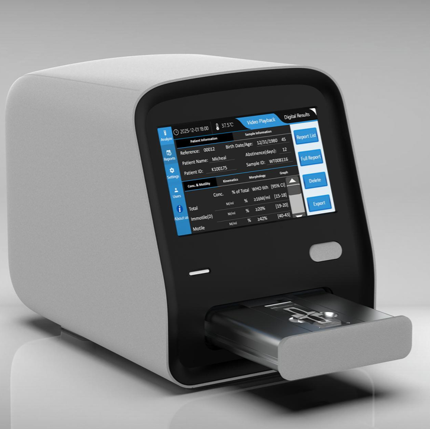

# iSperm Nexus DX1 Instrument Operation User Manual

English Version - Human Edition

Version: Draft 1  
Release date: July 2026  
Manufacturer: iSperm Medical

**Figure 1. Nexus DX1 instrument**

## Revision History

| Version | Date | Description |
| --- | --- | --- |
| Draft 1 | July 2026 | Expanded and edited English instrument operation manual draft. |

## Important Notice

Read this manual carefully before installing, operating, cleaning, or maintaining the Nexus DX1 instrument. Keep this manual near the instrument for reference by trained operators and service personnel.

Nexus DX1 is intended to support laboratory semen analysis workflows by acquiring and processing microscopic images of in vitro human semen samples. The system provides image-derived data and report outputs for qualified laboratory professionals.

The instrument does not independently establish or exclude any clinical condition. Final interpretation and clinical decision-making must be performed by qualified professionals according to local laboratory procedures, applicable regulations, and relevant clinical guidelines.

## 1. Intended Use

Nexus DX1 is intended for automated acquisition and processing of microscopic images of in vitro human semen samples. The system generates structured analysis data related to observable sample characteristics, including concentration, motility, kinematics, morphology, and related result categories supported by the installed software configuration.

The system is designed for use in professional laboratory environments by trained operators.

## 2. How to Use This Manual

This manual describes the instrument, installation requirements, basic operation, routine handling, cleaning, and troubleshooting of Nexus DX1.

Use this manual together with:

- The Instrument APP User Guide
- The PC Software User Guide, if applicable
- Local laboratory standard operating procedures
- Quality control and calibration instructions supplied by iSperm Medical or the distributor

Text marked as **Warning**, **Caution**, or **Note** should be read carefully.

| Signal Word | Meaning |
| --- | --- |
| **Warning** | Indicates a risk that may cause personal injury, infection risk, electrical hazard, or serious instrument damage. |
| **Caution** | Indicates a condition that may affect instrument performance, test reliability, or data integrity. |
| **Note** | Provides useful operating information or recommended practice. |

## 3. Safety Information

### 3.1 General Safety

- Operate the instrument only after receiving appropriate training.
- Do not use the instrument for purposes other than its intended laboratory use.
- Do not open the instrument housing or attempt internal repair unless authorized by iSperm Medical or the distributor.
- Keep liquids, reagents, and metal objects away from electrical connectors and ventilation areas.
- Stop using the instrument immediately if abnormal smell, smoke, unusual noise, overheating, or visible damage is observed.
- If abnormal conditions occur, turn off the power switch, disconnect the power adapter, and contact the distributor or authorized service provider.

### 3.2 Biological Safety

Human semen samples must be handled as potentially infectious biological material.

- Wear laboratory coat, disposable gloves, and other personal protective equipment required by local procedures.
- Avoid direct contact with samples, used slides, and contaminated accessories.
- Dispose of used consumables and contaminated materials as biological or medical waste according to local regulations.
- Clean and disinfect work surfaces after sample handling.

### 3.3 Electrical Safety

- Use only the supplied power adapter or an approved replacement supplied by iSperm Medical or the distributor.
- Connect the instrument to a properly grounded power outlet.
- Do not use a damaged power cable, adapter, or plug.
- Do not connect or disconnect peripheral devices with wet hands.
- Disconnect power before moving the instrument or cleaning external surfaces.

### 3.4 Operating Environment

Place the instrument in a stable laboratory environment.

Recommended conditions:

| Item | Requirement |
| --- | --- |
| Operating temperature | 0 °C to 40 °C |
| Relative humidity | < 85%, non-condensing |
| Storage temperature | -10 °C to 40 °C |
| Storage relative humidity | < 85%, non-condensing |

Avoid installation in the following locations:

- Direct sunlight
- Strong vibration or unstable benches
- Near centrifuges or shaking equipment
- High dust areas
- Areas with rapid temperature change
- Near strong electromagnetic sources
- Locations exposed to water splash or chemical vapor

## 4. Product Overview

Nexus DX1 is an all-in-one semen analysis instrument with an integrated touchscreen, optical imaging system, temperature-controlled stage, internal control system, and instrument software.

Typical analysis functions include:

- Concentration analysis
- Motility analysis
- Kinematic parameter analysis
- Morphology analysis
- Round cell or non-sperm particle related analysis, depending on software configuration
- Report storage, review, playback, deletion, and export

## 5. Main Components

Nexus DX1 includes the following major internal and external components:

| Component | Description |
| --- | --- |
| Optical system | Captures microscopic images of semen samples. |
| Digital camera | Acquires image or video data for analysis. |
| Motorized stage | Positions the sample chamber for image acquisition. |
| Heating stage | Maintains the sample testing area at the configured temperature. |
| Touchscreen | Provides local APP operation and result review. |
| Computer control system | Controls imaging, analysis, data storage, and user interface functions. |
| Front sample drawer/door | Used to load and remove the sample chamber. |
| Rear interfaces | Used for power, USB devices, PC connection, and external display or accessories where applicable. |

## 6. Supplied Accessories

Check the packing list when unpacking the instrument. The actual accessories should follow the packing list supplied with the instrument.

Typical accessories may include:

- Nexus DX1 analyzer
- Power adapter and power cable
- Keyboard and mouse
- Wired barcode scanner
- USB flash disk for APP update and report export
- Calibration slide
- QC certificate or QC materials, if supplied
- User documentation
- Warranty certificate
- Packing list
- Connection cables for PC workstation or external display, if supplied

> Note: If any accessory is missing, damaged, or inconsistent with the packing list, contact the distributor before using the instrument.

## 7. Technical Specifications

| Item | Specification |
| --- | --- |
| Product name | Nexus DX1 |
| Application | Automated image acquisition and processing of in vitro human semen samples |
| Light source | LED |
| Default stage temperature | 37 °C |
| Temperature setting range | 35 °C to 40 °C |
| Display | Integrated 7-inch touchscreen |
| Interfaces | USB ports, power input, PC data connection, external display connection where configured |
| Work environment | 0 °C to 40 °C; relative humidity < 85% |
| Storage environment | -10 °C to 40 °C; relative humidity < 85% |
| Weight | Approximately 7 kg |
| Dimensions | 283 mm (L) x 207 mm (W) x 244 mm (H) |
| Power adapter | Input 100-240 V AC, 50/60 Hz; output 12 V DC, 5 A, 60 W |

## 8. Instrument Description

### 8.1 Front View

The front side of Nexus DX1 includes the touchscreen, indicator lights, and sample drawer/door.

Typical front indicators:

| Indicator | Status | Meaning |
| --- | --- | --- |
| Power indicator | On | Rear power switch is on and power is supplied. |
| Power indicator | Off | Rear power switch is off or power is not supplied. |
| Function indicator | Green | System is ready or operating normally. |
| Function indicator | Blue | Analysis is in progress. |
| Function indicator | Red | Door movement, warning, or system condition requiring attention. |

> Note: Indicator behavior may vary by software or hardware version. Confirm the final colors and meanings before publication.

### 8.2 Back View

The rear side of the instrument includes the power switch, power input, USB ports, and data/display interfaces.

Typical rear interfaces:

- Power switch
- Power adapter input
- USB ports for keyboard, mouse, barcode scanner, USB flash disk, or service use
- PC data connection port
- External display connection port, where applicable

> Caution: Use only supported ports and accessories. Do not insert unsupported devices into service or internal-use ports.

## 9. Unpacking and Installation

### 9.1 Unpacking

1. Place the shipping carton on a stable surface.
2. Open the carton carefully.
3. Remove the packing materials.
4. Lift the instrument from the carton with care.
5. Check the instrument and accessories against the packing list.
6. Keep the original carton and packing materials for future transportation or service return.

> Caution: Nexus DX1 is a precision instrument. Avoid impact, dropping, or excessive tilting during unpacking.

### 9.2 Installation Site

Install the instrument on a flat, stable bench with sufficient space for sample handling, accessories, and ventilation.

Recommended site requirements:

- Stable bench surface
- Easy access to power outlet
- Sufficient clearance around the instrument
- No direct sunlight on the screen or sample area
- No strong vibration
- Clean and dry environment

### 9.3 Power Connection

1. Confirm that the rear power switch is off.
2. Connect the supplied power adapter to the instrument.
3. Connect the power cable to a grounded power outlet.
4. Confirm that the cable is not stretched, pinched, or placed where operators may trip.

### 9.4 Peripheral Connection

Connect only supported peripheral devices.

Common peripherals include:

- Keyboard
- Mouse
- Barcode scanner
- USB flash disk supplied with the instrument
- PC workstation connection cable, if applicable

Turn off the instrument before connecting or disconnecting peripherals if required by local procedure or service instruction.

## 10. Switching On the Instrument

1. Confirm that the instrument is placed on a stable bench.
2. Confirm that the power adapter and required peripherals are connected.
3. Turn on the rear power switch.
4. Wait for the system to start.
5. Confirm that the touchscreen displays the main screen.
6. Allow the heating stage to reach the configured temperature before routine analysis.

> Note: The default semen analysis temperature is commonly 37 °C. Confirm the configured temperature before testing.

## 11. Main Screen

After startup, the integrated touchscreen displays the main software interface. Typical functions include:

- **Analyze**: Inspect sample chambers, enter sample information, and start analysis.
- **Reports**: Review, play back, delete, and export completed results.
- **Settings**: Configure language, date/time, temperature, microscopic fields, calibration, QC, and other system options where available.
- **Users**: Change password and edit local Company, Center, Laboratory, and Technician information.
- **About us**: View system and manufacturer information.

Refer to the Instrument APP User Guide for detailed software operation.

## 12. Routine Operation Overview

This section provides a high-level routine workflow. Detailed software steps are described in the Instrument APP User Guide.

1. Switch on Nexus DX1.
2. Wait until the heating stage reaches the configured temperature.
3. Prepare the semen sample according to the laboratory procedure.
4. Load the sample chamber or slide according to the approved consumable instructions.
5. Enter **Analyze**.
6. Inspect the selected chamber.
7. Enter patient and sample information if required.
8. Start the analysis.
9. Review the digital results.
10. Open **Reports** to review, export, or manage saved results.
11. Remove used consumables and dispose of them according to biological safety procedures.
12. Clean the work area and instrument external surfaces if needed.

## 13. Settings Commonly Checked Before Use

Before routine operation, confirm:

- System date and time
- Language
- Heating stage temperature
- Number of microscopic fields
- Calibration status
- QC status, if required by the laboratory
- USB flash disk availability for report export, if needed

Do not change calibration or analysis parameters unless authorized by the laboratory supervisor, distributor, or service provider.

## 14. Cleaning and Routine Maintenance

### 14.1 External Cleaning

1. Turn off the instrument if required by the cleaning procedure.
2. Disconnect power if cleaning near electrical interfaces.
3. Wipe external surfaces with a soft lint-free cloth.
4. If disinfection is required, use a disinfectant approved by the laboratory and compatible with the instrument surface.
5. Do not spray liquid directly onto the instrument.
6. Do not allow liquid to enter ports, vents, drawer gaps, or the touchscreen edge.

### 14.2 Touchscreen Cleaning

- Use a soft lint-free cloth.
- Do not use abrasive materials.
- Do not press the screen with sharp objects.
- Avoid excessive liquid on the screen surface.

### 14.3 Sample Area Cleaning

- Remove used consumables after analysis.
- Treat all used consumables as potentially infectious.
- Wipe accessible external sample-loading surfaces if contamination is observed.
- Do not attempt to clean internal optical components unless instructed by authorized service personnel.

### 14.4 Maintenance Schedule

| Frequency | Action |
| --- | --- |
| Daily or before use | Check power cable, adapter, touchscreen, sample drawer, and cleanliness. |
| Daily or according to laboratory SOP | Confirm temperature setting and system readiness. |
| According to laboratory SOP | Perform QC or calibration checks. |
| When needed | Export and back up reports. |
| When contamination occurs | Clean and disinfect affected external surfaces. |
| Service interval | Contact distributor or authorized service provider for inspection or maintenance if required. |

## 15. Transport and Storage

Before moving or transporting the instrument:

1. Export or back up important data if required.
2. Remove samples, consumables, and USB devices.
3. Shut down the software properly.
4. Turn off the rear power switch.
5. Disconnect the power adapter and peripherals.
6. Clean the external surfaces if needed.
7. Use the original packing materials whenever possible.

During storage and transport:

- Keep the instrument dry.
- Keep the instrument upright.
- Avoid shock, vibration, and heavy loads on the package.
- Avoid extreme temperature and humidity.

## 16. Troubleshooting

| Situation | Possible Cause | Recommended Action |
| --- | --- | --- |
| Instrument does not power on. | Power adapter not connected, power switch off, or outlet unavailable. | Check power outlet, adapter, cable, and rear power switch. |
| Touchscreen does not display the main screen. | System is still starting or software startup issue. | Wait for startup. If the issue continues, restart the instrument. |
| Heating stage does not reach target temperature. | Temperature setting, environment, or system issue. | Confirm setting and allow warm-up time. Contact service if unresolved. |
| USB flash disk is not recognized. | USB disk not inserted correctly or unsupported format/device. | Use the supplied USB flash disk and insert it into a rear USB port. |
| Barcode scanner, keyboard, or mouse does not work. | Peripheral not connected or unsupported. | Reconnect the device or use a supported USB device. |
| Red indicator remains on. | Door, warning, or system condition requires attention. | Check on-screen message. Restart if appropriate. Contact service if the condition remains. |
| Abnormal smell, smoke, or overheating occurs. | Possible electrical or internal fault. | Turn off power immediately, disconnect the power adapter, and contact the distributor or service provider. |

## 17. Limitations and Operator Responsibilities

- Use only approved consumables and procedures.
- Do not use the instrument outside the specified environment.
- Do not rely on instrument output alone for clinical decision-making.
- Maintain traceability of samples, operators, QC, and reports according to laboratory policy.
- Ensure that data export, backup, and deletion are performed according to local data management requirements.

## 18. Service and Support

For installation support, technical assistance, accessories, calibration, or maintenance, contact the distributor or iSperm Medical.

Contact email: market@isperm.com  
Website: www.isperm.com

