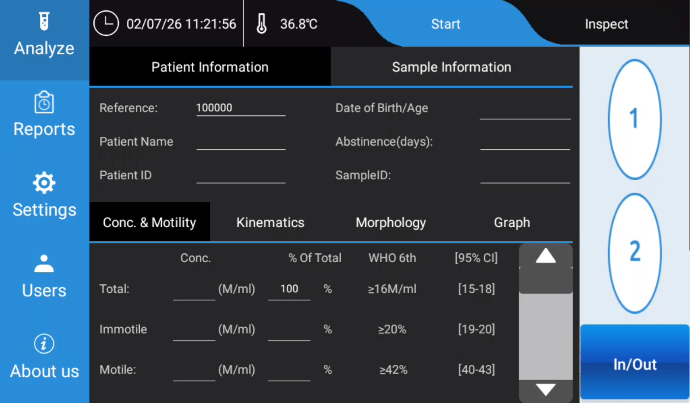
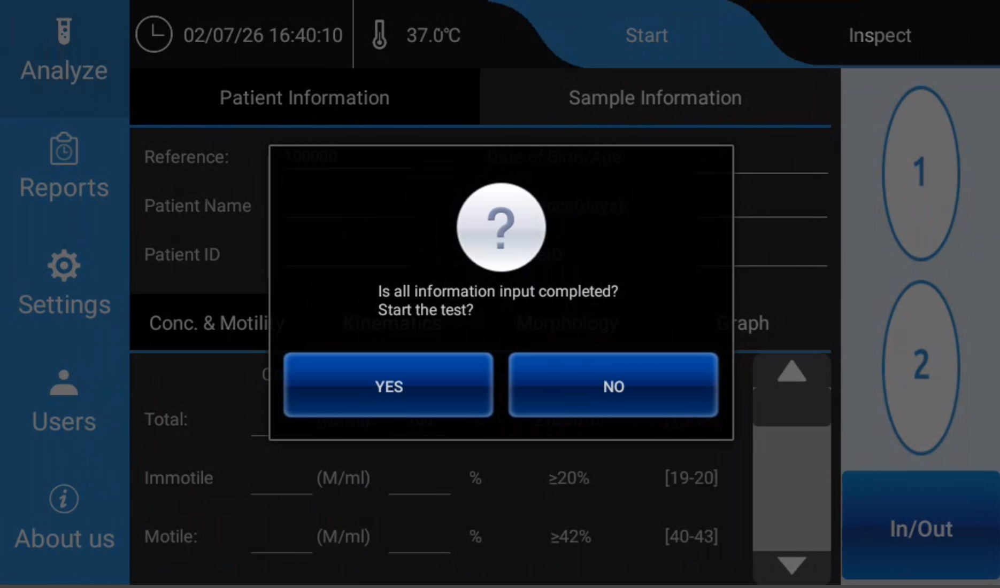

# iSperm Nexus DX1 Instrument APP User Guide

English Version - Human Edition

## Chapter 6. Analysis

### 6.1 Overview

The **Analyze** function is used to inspect a semen sample image, select the chamber to be tested, enter optional patient and sample information, and start an automated sperm quality analysis.

Nexus DX1 is designed for a simplified workflow. The operator may enter patient and sample information before testing, or leave the information fields blank. If no information is entered, the system automatically assigns a unique **Reference** number to the test record. The analysis result can later be found in the **Reports** section by using this reference number.

The analysis result is displayed in four result tabs at the lower part of the screen:

- **Conc. & Motility**
- **Kinematics**
- **Morphology**
- **Graph**

> Note: Nexus DX1 provides image-derived analysis data for laboratory use. Final clinical interpretation should be made by qualified professionals according to local laboratory procedures and applicable clinical guidelines.

### 6.2 Analyze Screen

From the left navigation bar, tap **Analyze** to enter the analysis function.

The Analyze screen contains the following main areas:

| Area | Description |
| --- | --- |
| Top status bar | Displays system time and heating stage temperature. |
| Start / Inspect tabs | Used to inspect the sample and start a test. |
| Patient Information | Used to enter or confirm patient-related information. |
| Sample Information | Used to enter or confirm sample-related information. |
| Chamber selection | Used to select chamber **1** or **2**. |
| Result tabs | Displays Conc. & Motility, Kinematics, Morphology, and Graph results. |

**Figure 6-1. Analyze screen**

### 6.3 Inspect the Sample

Before starting a test, the operator should inspect the semen sample image.

1. Tap **Analyze** on the left navigation bar.
2. Tap **Inspect** on the upper-right area of the screen.
3. Select chamber **1** or chamber **2**.
4. Observe the microscopic image of the semen sample.
5. Confirm that the selected chamber contains a suitable sample image for analysis.

Use the chamber that contains the sample image you want to analyze. The test will be performed on the microscopic image from the chamber selected during the Inspect step.

If the sample image is not suitable, prepare or load the sample again according to the laboratory procedure before starting the test.

### 6.4 Enter Patient Information

After inspection, tap **Start** to enter or confirm patient and sample information.

In the **Patient Information** section, the operator may enter:

- **Reference**
- **Patient Name**
- **Patient ID**

The **Reference** field is automatically generated by the system. The operator may use this reference number to locate the result in the **Reports** section after the test.

Patient information is optional. If the fields are left blank, the system can still start the analysis and save the result with the automatically assigned reference number.

### 6.5 Enter Sample Information

In the **Sample Information** section, the operator may enter:

- **Date of Birth / Age**
- **Abstinence (days)**
- **Sample ID**

Sample information is optional. However, entering complete information is recommended when the result will be reviewed, printed, exported, or linked to external laboratory records.

### 6.6 Start the Test

After confirming the selected chamber and entering any required information:

1. Tap **Start**.
2. A confirmation message appears:

   **"Is all information input completed? Start the test?"**

3. Tap **YES** to start the analysis.
4. Tap **NO** to return to the information screen and check or edit the information.

**Figure 6-2. Start test confirmation**

When **YES** is selected, Nexus DX1 starts automated analysis of the semen microscopic image in the selected chamber.

Do not remove the sample, switch chambers, or interrupt the instrument during the test unless instructed by the system.

### 6.7 View Analysis Results

After the test is completed, the result is shown in the lower part of the Analyze screen. The operator can switch between the four result tabs.

#### 6.7.1 Conc. & Motility

The **Conc. & Motility** tab displays concentration and motility-related results.

Typical displayed information includes:

- Total sperm concentration
- Immotile sperm
- Motile sperm
- Percentage of total
- WHO 6th Edition reference information
- 95% confidence interval information, where available

The values shown in this tab are used to review the overall concentration and motility profile of the sample.

#### 6.7.2 Kinematics

The **Kinematics** tab displays sperm movement parameters calculated from the analyzed image sequence.

Depending on system configuration, kinematic parameters may include:

- VCL
- VSL
- VAP
- LIN
- STR
- WOB
- ALH
- BCF
- Other movement-related parameters supported by the system

These parameters help describe sperm movement pattern and trajectory characteristics.

#### 6.7.3 Morphology

The **Morphology** tab displays morphology-related analysis results.

Depending on the enabled analysis configuration, the system may provide information related to:

- Normal sperm
- Abnormal sperm
- Head defects
- Tail defects
- Cytoplasmic residue
- Droplet-related findings
- Other morphology categories supported by Nexus DX1

Morphology results should be reviewed according to the laboratory's validated procedures.

#### 6.7.4 Graph

The **Graph** tab displays graphical analysis information. This view helps the operator review the sample result visually and may include distribution charts, movement-related graphs, or other result visualizations available in the system software.

### 6.8 Retrieve the Result from Reports

Each completed test is saved by the system. If patient or sample information was not entered, use the automatically generated **Reference** number to identify the record.

To retrieve a result:

1. Tap **Reports** on the left navigation bar.
2. Locate the test record by reference number, patient information, sample information, or test time.
3. Open the record to view, print, export, or review the report according to the available report functions.

### 6.9 Recommended Operating Notes

- Inspect the chamber before starting the test.
- Confirm that the correct chamber, **1** or **2**, is selected.
- Enter patient and sample information when traceability is required.
- If information is not entered, record or note the automatically generated reference number.
- Do not disturb the instrument during analysis.
- Review all result tabs before saving, printing, or exporting the report.
- Follow the laboratory's sample preparation and quality control procedures.

### 6.10 Troubleshooting

| Situation | Possible Cause | Recommended Action |
| --- | --- | --- |
| The operator cannot find the result after testing. | Patient or sample information was not entered. | Search in **Reports** using the automatically generated reference number or test time. |
| The wrong chamber was analyzed. | Chamber selection was not confirmed during Inspect. | Repeat the analysis with the correct chamber selected. |
| The confirmation dialog appears before the operator is ready. | **Start** was tapped before information entry was completed. | Tap **NO**, complete or confirm the information, then tap **Start** again. |
| Result fields are incomplete or unexpected. | Sample image, chamber loading, or analysis conditions may not be suitable. | Inspect the sample image again, prepare a new chamber if needed, and repeat the test according to laboratory procedure. |

## Chapter 7. Reports

### 7.1 Overview

The **Reports** function is used to review, open, delete, and export completed test results. Each completed analysis is saved as a report record. The operator can review the digital result data, open the full report, play back the analysis video, delete selected records, or export reports to the USB flash disk supplied with the instrument.

The Reports screen includes two main viewing modes:

- **Digital Results**: Displays the report list and numerical result details.
- **Video Playback**: Displays the recorded microscopic video of the selected test.

The right-side function buttons include:

- **Report List**
- **Full Report**
- **Delete**
- **Export**

### 7.2 Open the Reports Function

1. Tap **Reports** on the left navigation bar.
2. The system enters the Reports function area.
3. Tap **Report List** if the report list is not already displayed.
4. Confirm that **Digital Results** is selected at the top of the screen.

The main area displays all saved test results in a list.

**Figure 7-1. Reports screen - Report List and Digital Results**  
*[Insert screenshot: report list showing saved test results]*

### 7.3 Report List

The **Report List** displays saved test records. Each row represents one completed test.

Typical columns include:

- **Ref.**
- **Date**
- **Time**
- **Patient Name**
- **Patient ID**
- **CONC. Total (M/ml)**
- **MOT Motile (%)**
- **MOR Normal (%)**

To select a report, tap one row in the list. The selected row is used for **Full Report**, **Delete**, and **Video Playback** operations.

### 7.4 Open a Full Report

To open the full report of a selected result:

1. Enter **Reports**.
2. Tap **Report List**.
3. Select one report row from the list.
4. Tap **Full Report** on the right side.

The screen changes from the report list to the selected report's digital result view.

**Figure 7-2. Full Report - Digital Results**  
*[Insert screenshot: selected report digital result view]*

### 7.5 Review Digital Result Data

In the full report view, the patient and sample information is shown in the upper part of the screen. The digital result data is shown in the lower part of the screen.

The operator can switch between the following result tabs:

- **Conc. & Motility**
- **Kinematics**
- **Morphology**
- **Graph**

Tap each tab to review the corresponding result category for the selected test.

#### 7.5.1 Conc. & Motility

The **Conc. & Motility** tab displays concentration and motility results, such as total concentration, immotile sperm, motile sperm, percentage of total, WHO 6th Edition reference information, and confidence interval information where available.

#### 7.5.2 Kinematics

The **Kinematics** tab displays sperm motion parameters calculated by the system. These values describe the movement characteristics of the analyzed sperm cells.

#### 7.5.3 Morphology

The **Morphology** tab displays morphology-related analysis results for the selected test.

#### 7.5.4 Graph

The **Graph** tab displays graphical summaries of the selected result, such as motility and morphology charts.

**Figure 7-3. Full Report - Graph tab**  
*[Insert screenshot: graph view showing motility and morphology charts]*

### 7.6 Video Playback

The operator can review the recorded microscopic video for a selected test.

To open video playback:

1. Open **Reports**.
2. Select a report from the report list, or open the report in **Full Report** view.
3. Tap **Video Playback** at the top of the screen.

The screen displays the microscopic video recorded during analysis.

**Figure 7-4. Video Playback**  
*[Insert screenshot: microscopic video playback view]*

Use video playback to visually review the analyzed sample image. This function is helpful for record review, training, and troubleshooting.

### 7.7 Delete a Report

To delete a saved report:

1. Tap **Reports** on the left navigation bar.
2. Tap **Report List**.
3. Select the report row that should be deleted.
4. Tap **Delete** on the right side.
5. Confirm the deletion if a confirmation message appears.

> Caution: Deleted reports may not be recoverable. Confirm that the correct report is selected before deleting it.

### 7.8 Export Reports to USB Flash Disk

The **Export** function downloads saved report files to the USB flash disk supplied with the instrument.

To export reports:

1. Insert the USB flash disk supplied with the instrument into a USB port on the back of Nexus DX1.
2. Tap **Reports** on the left navigation bar.
3. Tap **Export** on the right side.
4. When the password prompt appears, enter:

   **000000**

5. Confirm the export operation.
6. Wait until the system finishes downloading the report files to the USB flash disk.
7. Remove the USB flash disk only after the export is completed.

> Note: Use the USB flash disk supplied with the instrument when exporting reports. Do not remove the USB flash disk during export.

### 7.9 Recommended Operating Notes

- Use **Report List** to locate saved test results.
- Select the correct row before tapping **Full Report**, **Delete**, or **Video Playback**.
- Use **Digital Results** to review numerical result data.
- Use **Video Playback** to review the recorded microscopic video.
- Insert the supplied USB flash disk before using **Export**.
- Enter password **000000** when prompted during export.
- Confirm that export is completed before removing the USB flash disk.

### 7.10 Troubleshooting

| Situation | Possible Cause | Recommended Action |
| --- | --- | --- |
| The expected report is not visible in the list. | The result may be listed under its automatically assigned reference number or another test time. | Check the **Ref.**, **Date**, and **Time** columns. |
| Full Report does not open. | No report row is selected. | Select one report row, then tap **Full Report** again. |
| The wrong report was opened. | A different row was selected in the report list. | Return to **Report List**, select the correct row, and tap **Full Report**. |
| Video playback is not shown. | The operator is still in Digital Results view. | Tap **Video Playback** at the top of the screen. |
| Export does not start. | USB flash disk is not inserted or not recognized. | Insert the supplied USB flash disk into the USB port on the back of the instrument, then try again. |
| Password is requested during export. | Export is password protected. | Enter **000000**. |

